<a id = "top"></a>

[]()


---

> **TL;DR:**
> - This project implements a **Retrieval-Augmented Generation (RAG)** MCP Server using **LangChain wrappers** for **ChromaDB** and **Hugging Face** models.
> - Designed for seamless integration with **Claude Desktop** as the MCP client.
> - Uses a single persistent **Chroma vector database** with multiple collections (domains).
> - Automatically retrieves and ranks the most relevant context for Claude, enabling **domain-aware reasoning** and **citation-based responses**.

---

[]()

<!-- - <a href = "TOOLS.md">Available Tools</a> -->
- <a href = "#project-overview">Project Overview</a>
- <a href = "#features">Features</a>
- <a href = "TOOLS.md">Available Tools</a>
- <a href = "#getting-started">Getting Started</a>
    - Prerequisites
    - Installation
- <a href = "#claude-integration">Claude Integration</a>
    - Configuration Example
- <a href = "#project-structure">Project Structure</a>

<!-- <div align = "center">

<a href = "#project-overview">
  <kbd> <br> Project Overview <br> </kbd>
</a>

<a href = "#features">
  <kbd> <br> Features <br> </kbd>
</a>

<a href = "TOOLS.md">
  <kbd> <br> Available Tools <br> </kbd>
</a>

<a href = "#getting-started">
  <kbd> <br> Getting Started <br> </kbd>
</a>

<a href = "#claude-integration">
  <kbd> <br> Claude Integration <br> </kbd>
</a>

<a href = "#project-structure">
  <kbd> <br> Project Structure <br> </kbd>
</a>

</div> -->

---

<a id = "project-overview"></a>

[]()

This project implements a **LangChain-powered Retrieval-Augmented Generation (RAG)** pipeline hosted as a **FastMCP server** for integration with Claude Desktop.

It uses:
- **`langchain_chroma.Chroma`** for persistent, domain-based vector stores.
- **`langchain_huggingface.HuggingFaceEmbeddings`** for local or HuggingFace embedding models.
- **`langchain_community.cross_encoders.HuggingFaceCrossEncoder`** for local or HuggingFace reranking models for better relevance tracking.
- **FastMCP** for exposing these retrieval and document management tools to Claude Desktop.

Each Chroma collection represents a distinct knowledge domain or document.
Claude queries are routed to the appropriate collection, which retrieves top-k results and returns relevant context and citations.

This project implements a **LangChain-powered Retrieval-Augmented Generation (RAG)** pipeline hosted as a **FastMCP server** for Claude Desktop.  

### **⚡Workflow:**

```mermaid
flowchart TD
  Claude[Claude Desktop]
  MCP[MCP Server: FastMCP + LangChain]
  LangChain[LangChain Wrappers → ChromaDB + HuggingFace]
  Claude --> MCP --> LangChain --> Claude
```

<div align = "center">



</div>

<div align="right">
  <a href="#top"><kbd> <br> 🡅 Back to Top <br> </kbd></a>
</div>

---

<a id = "features"></a>

[]()

- **PDF Embedding:** Add PDFs locally or via URL directly into a chosen collection.
- **Smart Retrieval:** Retrieve context chunks per collection or across multiple collections.
- **Reranking Support:** Uses a HuggingFace **cross-encoder reranker** for better document relevance.
- **Document Management:** List, rename, and inspect metadata for locally stored documents.
- **Collection Management:** Create, list, and delete ChromaDB collections dynamically.
- **Citation Provider:** Automatically append citations for generated answers.
- **Self-Describing Tools:** `describeTools()` lists all available MCP tools dynamically for introspection.

<div align="right">
  <a href="#top"><kbd> <br> 🡅 Back to Top <br> </kbd></a>
</div>

<!-- ---

<a id = "tools"></a>

[]()

This MCP server exposes a set of tools that can be invoked by Claude Desktop to perform document and collection operations — including embedding, retrieval, metadata management, and citation generation.

For a full list of available tools, their arguments, and example usage, see the dedicated documentation:  
[**View All Tools → TOOLS.md**](TOOLS.md)

<div align="right">
  <a href="#top"><kbd> <br> 🡅 Back to Top <br> </kbd></a>
</div> -->

---

<a id = "getting-started"></a>

[]()

### **🔧 Prerequisites**
> [!IMPORTANT]
> - Ensure Anaconda is installed, if not you can download from [Anaconda](https://www.anaconda.com/download/success) and also Git (if not available, download from [Github](https://git-scm.com/downloads)).

### **⚙️ Installation**

1. Create and Activate Conda Environment
```bash
conda create -n MCP python=3.11.13 -y
conda activate MCP
```

2. Clone the Repository
```bash
git clone https://github.com/NSANTRA/RAG-MCP-Server.git
cd RAG-MCP-Server
```

3. Install Dependencies
```bash
pip install -r requirements.txt
```

4. Configure .env
```bash
# Example:

# If your system has Nvidia GPU CUDA Toolkit setup, you can set the device to cuda, otherwise set it to cpu
DEVICE = "cuda"

DOCUMENT_DIR = "C:/Users/<yourusername>/Projects/RAG-MCP-Server/Documents"
CHROMA_DB_PERSIST_DIR = "C:/Users/<yourusername>/Projects/RAG-MCP-Server/Databases"

EMBEDDING_MODEL = "C:/Users/<yourusername>/Projects/RAG-MCP-Server/Models/MiniLM"
RERANKER_MODEL = "C:/Users/<yourusername>/Projects/RAG-MCP-Server/Models/MiniLM-Reranker"
```

> [!CAUTION]
> You need to mention the absolute path wherever needed.

> [!TIP]
> You can swap the embedding or reranker paths for any HuggingFace models.

<div align="right">
  <a href="#top"><kbd> <br> 🡅 Back to Top <br> </kbd></a>
</div>

---

<a id = "claude-integration"></a>

[]()

> [!IMPORTANT]
> You need to download the Claude Desktop app in order to run the MCP Server as it needs a MCP Client.
> You can download the client, [here](https://claude.com/download)

Claude Desktop automatically launches the RAG MCP Server when it’s registered in the MCP configuration file.  
You **do not need to run the Python script manually**.

### **🛠️ Configuration Example**
Add the following entry to your Claude MCP configuration file (typically located in your Claude Desktop settings folder):

```json
{
  "mcpServers": {
    "RAG": {
      "command": "C:/Users/<yourusername>/anaconda3/envs/MCP/python.exe",
      "args": ["<absolute to the Main.py>"],
      "options": {
        "cwd": "absolute project root directory path"
      }
    }
  }
}
```

> ⚠️ **Common Issue:**
> If Claude fails to start the MCP server, ensure that:
> - The Python path points to your Conda environment’s executable.
> - `Main.py` has no syntax errors and dependencies are installed.
> - The `cwd` option matches your project root directory.


<div align="right">
  <a href="#top"><kbd> <br> 🡅 Back to Top <br> </kbd></a>
</div>

---

<a id = "project-structure"></a>

[](https://git.io/typing-svg)

```tree
├── Main.py                 # Entry point - starts the FastMCP server
│
├── Modules/
│ ├── Config.py             # Loads env vars, sets up embeddings & reranker
│ ├── Core.py               # Document-level utilities (metadata, citation, rename)
│ ├── Database.py           # ChromaDB logic for embedding/retrieval
│ ├── Utils.py              # Helper functions (file ops, reranking)
│ └── ToolDefinition.py     # MCP tool manifests and argument schemas
│
├── .env                    # Environment configuration
├── requirements.txt        # Dependencies
└── README.md
```

<div align="right">
  <a href="#top"><kbd> <br> 🡅 Back to Top <br> </kbd></a>
</div>

---

<a id = "references"></a>

[](https://git.io/typing-svg)

1. LangChain RAG Workflow <br>
[LangChain Documentation — RAG](https://python.langchain.com/docs/use_cases/question_answering/)

2. Chroma Vector Database <br>
[Chroma Docs](https://docs.trychroma.com/)

3. HuggingFace Embeddings and Cross-Encoders <br>
[Sentence Transformers](https://huggingface.co/sentence-transformers) <br>
[Cross-Encoder Models](https://huggingface.co/cross-encoder)

4. Anthropic MCP & Claude Desktop <br>
[Model Context Protocol Official Site](https://modelcontextprotocol.io/) <br>
[Claude Desktop Overview](https://www.anthropic.com/claude)
